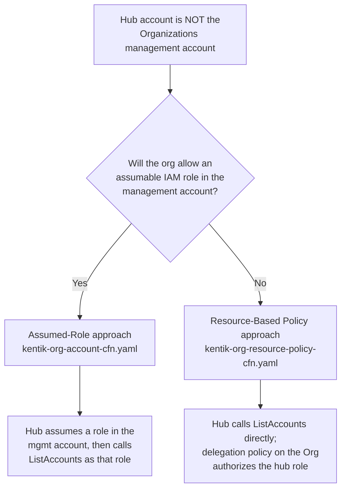
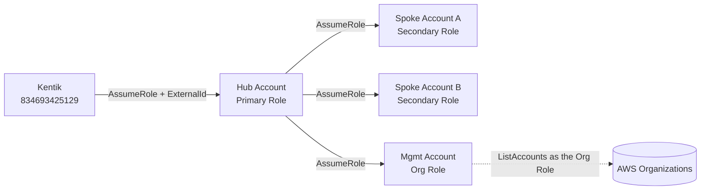
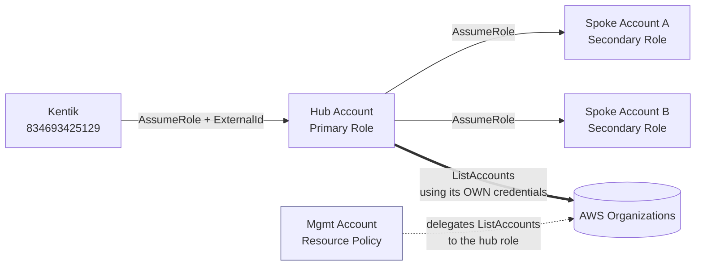

# Kentik AWS Metadata Collection — CloudFormation Deployment

Deploys the Kentik IAM roles and policies across AWS accounts. Three architectures are supported:

- **Standard** — Kentik connects directly to each account. Use this when you have one account or don't need a centralized hub.
- **Nested (Hub/Spoke)** — Kentik connects to one hub account, which assumes roles in each spoke account. Use this for multi-account environments where the hub account is the AWS Organizations management account.
- **Nested (Hub/Spoke, Non-Org Account — Assumed Role)** — Same as above, but the hub account is not the Organizations management account. Creates an IAM role in the management account that the hub **assumes** to call `organizations:ListAccounts`.
- **Nested (Hub/Spoke, Non-Org Account — Resource-Based Policy)** — Same goal as above, but creates **no IAM role/principal** in the management account. Instead it attaches an [AWS Organizations resource-based delegation policy](https://docs.aws.amazon.com/organizations/latest/userguide/security_iam_resource-based-policy-examples.html) that lets the hub role call `organizations:ListAccounts` directly. Use this when stakeholders refuse to grant any assumable access into the management account.

### Choosing a non-org-account approach



| | Assumed-Role | Resource-Based Policy |
|---|---|---|
| Artifact in management account | IAM **role** + managed policy | Organizations **resource policy** only |
| Hub gains a credential context inside mgmt account? | **Yes** (via `sts:AssumeRole`) | **No** — hub uses its own credentials |
| Permissions granted | `organizations:ListAccounts` | `organizations:ListAccounts` (+ `DescribeOrganization`) |
| Template | `kentik-org-account-cfn.yaml` | `kentik-org-resource-policy-cfn.yaml` |
| Constraint | One role per stack | Org allows only **one** resource policy total |

---

## Standard Configuration

Deploy `kentik-standard-account-cfn.yaml` independently in every account you want Kentik to monitor.

### Prerequisites

- AWS CLI configured with credentials for the target account
- Your **Kentik Company ID** — found in the Kentik portal under **Settings → Licenses** (the "Account #" field)

### Deploy

Run this once per account:

```bash
aws cloudformation deploy \
  --template-file kentik-standard-account-cfn.yaml \
  --stack-name kentik-metadata \
  --parameter-overrides KentikCompanyID=<your-company-id> \
  --capabilities CAPABILITY_NAMED_IAM \
  --region us-east-1
```

If Kentik needs access to a VPC Flow Log S3 bucket in that account, add:

```
S3BucketName=<your-flow-log-bucket-name>
```

After deployment, grab the role ARN from the stack outputs:

```bash
aws cloudformation describe-stacks \
  --stack-name kentik-metadata \
  --query "Stacks[0].Outputs"
```

### Configure Kentik

1. Log into the [Kentik portal](https://portal.kentik.com)
2. Navigate to **Settings → Cloud → AWS**
3. Add a new AWS account and enter the **role ARN** from the stack outputs
4. Repeat for each additional account

### Resources Created

| Resource | Purpose |
|---|---|
| `KentikMetadataPolicy` | Read-only metadata permissions (EC2, CloudWatch, etc.) |
| `KentikMetadataRole` | Assumed directly by Kentik's AWS account (`834693425129`) |

---

## Nested (Hub/Spoke) Configuration

Deploys IAM roles across multiple AWS accounts using a hub-and-spoke architecture. Kentik connects to one **hub** account, which assumes roles in each **spoke** account to collect metadata.

### Prerequisites

- AWS CLI configured with credentials for each target account (or permission to use CloudFormation StackSets)
- Your **Kentik Company ID** — found in the Kentik portal under **Settings → Licenses** (the "Account #" field)
- AWS Organizations enabled if you plan to deploy via StackSets

### Step 1 — Deploy the Hub Account

Run this once in the account Kentik will connect to directly.

```bash
aws cloudformation deploy \
  --template-file kentik-hub-account-cfn.yaml \
  --stack-name kentik-metadata-hub \
  --parameter-overrides KentikCompanyID=<your-company-id> \
  --capabilities CAPABILITY_NAMED_IAM \
  --region us-east-1
```

After deployment, grab the hub account ID from the stack outputs — you'll need it in Step 2:

```bash
aws cloudformation describe-stacks \
  --stack-name kentik-metadata-hub \
  --query "Stacks[0].Outputs"
```

### Step 2 — Deploy to Spoke Accounts

#### Option A: Single account (AWS CLI)

Repeat for each spoke account, substituting the correct credentials and hub account ID:

```bash
aws cloudformation deploy \
  --template-file kentik-spoke-account-cfn.yaml \
  --stack-name kentik-metadata-spoke \
  --parameter-overrides HubAccountId=<hub-account-id> \
  --capabilities CAPABILITY_NAMED_IAM \
  --region us-east-1
```

If Kentik needs access to a VPC Flow Log S3 bucket in that account, add:

```
S3BucketName=<your-flow-log-bucket-name>
```

#### Option B: All accounts via StackSets (recommended for large orgs)

This deploys to an entire AWS Organization OU in one command.

```bash
# 1. Create the StackSet
aws cloudformation create-stack-set \
  --stack-set-name kentik-metadata-spoke \
  --template-body file://kentik-spoke-account-cfn.yaml \
  --parameters ParameterKey=HubAccountId,ParameterValue=<hub-account-id> \
  --capabilities CAPABILITY_NAMED_IAM \
  --permission-model SERVICE_MANAGED \
  --auto-deployment Enabled=true,RetainStacksOnAccountRemoval=false

# 2. Deploy to an OU (replace ou-xxxx-xxxxxxxx with your target OU ID)
aws cloudformation create-stack-instances \
  --stack-set-name kentik-metadata-spoke \
  --deployment-targets OrganizationalUnitIds=ou-xxxx-xxxxxxxx \
  --regions us-east-1 \
  --operation-preferences FailureToleranceCount=2,MaxConcurrentCount=5
```

### Step 3 — Configure Kentik

1. Log into the [Kentik portal](https://portal.kentik.com)
2. Navigate to **Settings → Cloud → AWS**
3. Add a new AWS account and enter the **hub role ARN** from the Step 1 stack outputs
4. Kentik will automatically discover and assume the spoke roles

### Resources Created

| Template | Resource | Purpose |
|---|---|---|
| Hub | `KentikMetadataPrimaryPolicy` | Allows hub role to assume spoke roles + list org accounts |
| Hub | `KentikMetadataPrimaryRole` | Assumed by Kentik's AWS account (`834693425129`) |
| Spoke | `KentikMetadataSecondaryPolicy` | Read-only metadata permissions (EC2, CloudWatch, etc.) |
| Spoke | `KentikMetadataSecondaryRole` | Assumed by the hub role to collect spoke account metadata |

---

## Nested Accounts (Non-Org Account — Assumed Role)

Use this when you are deploying the hub/spoke architecture and the **hub account is not the AWS Organizations management account**. `organizations:ListAccounts` can only be called from the management account (or a delegated admin). This configuration deploys all three templates: hub, spoke, and an additional role in the management account that the hub assumes to perform account listing.

If your hub account **is** the management account, use the [Nested (Hub/Spoke) Configuration](#nested-hubspoke-configuration) section instead. If stakeholders will not allow an assumable role inside the management account, use the [Resource-Based Policy](#nested-accounts-non-org-account--resource-based-policy) section instead.



### Prerequisites

- AWS CLI profiles or credential contexts for three account types:
  - **Hub account** — the account Kentik connects to directly
  - **Spoke accounts** — accounts Kentik collects metadata from
  - **Management account** — the AWS Organizations management account
- Your **Kentik Company ID** — found in the Kentik portal under **Settings → Licenses** (the "Account #" field)

### Step 1 — Deploy the Hub Account

Switch credentials to the hub account and run:

```bash
aws cloudformation deploy \
  --template-file kentik-hub-account-cfn.yaml \
  --stack-name kentik-metadata-hub \
  --parameter-overrides KentikCompanyID=<your-company-id> \
  --capabilities CAPABILITY_NAMED_IAM \
  --region us-east-1
```

Retrieve the hub account ID from the stack outputs — you will need it in Steps 2 and 3:

```bash
aws cloudformation describe-stacks \
  --stack-name kentik-metadata-hub \
  --query "Stacks[0].Outputs"
```

Note the `HubAccountId` and `PrimaryRoleArn` values.

### Step 2 — Deploy to Spoke Accounts

#### Option A: Single account (AWS CLI)

Switch credentials to each spoke account and repeat:

```bash
aws cloudformation deploy \
  --template-file kentik-spoke-account-cfn.yaml \
  --stack-name kentik-metadata-spoke \
  --parameter-overrides HubAccountId=<hub-account-id> \
  --capabilities CAPABILITY_NAMED_IAM \
  --region us-east-1
```

If Kentik needs access to a VPC Flow Log S3 bucket in that account, add:

```
S3BucketName=<your-flow-log-bucket-name>
```

#### Option B: All accounts via StackSets (recommended for large orgs)

This deploys to an entire AWS Organization OU in one command. Run from an account with StackSets permissions:

```bash
# 1. Create the StackSet
aws cloudformation create-stack-set \
  --stack-set-name kentik-metadata-spoke \
  --template-body file://kentik-spoke-account-cfn.yaml \
  --parameters ParameterKey=HubAccountId,ParameterValue=<hub-account-id> \
  --capabilities CAPABILITY_NAMED_IAM \
  --permission-model SERVICE_MANAGED \
  --auto-deployment Enabled=true,RetainStacksOnAccountRemoval=false

# 2. Deploy to an OU (replace ou-xxxx-xxxxxxxx with your target OU ID)
aws cloudformation create-stack-instances \
  --stack-set-name kentik-metadata-spoke \
  --deployment-targets OrganizationalUnitIds=ou-xxxx-xxxxxxxx \
  --regions us-east-1 \
  --operation-preferences FailureToleranceCount=2,MaxConcurrentCount=5
```

### Step 3 — Deploy to the Management Account

Switch credentials to the AWS Organizations management account and run:

```bash
aws cloudformation deploy \
  --template-file kentik-org-account-cfn.yaml \
  --stack-name kentik-metadata-org \
  --parameter-overrides HubAccountId=<hub-account-id> \
  --capabilities CAPABILITY_NAMED_IAM \
  --region us-east-1
```

Retrieve the org role ARN from the stack outputs:

```bash
aws cloudformation describe-stacks \
  --stack-name kentik-metadata-org \
  --query "Stacks[0].Outputs"
```

Note the `OrgRoleArn` value — you will provide it to Kentik in Step 4.

The template creates a role whose trust policy allows any principal **from the hub account** to assume it (scoped by `aws:PrincipalAccount` condition). The hub role already has `sts:AssumeRole: *`, so no changes to the hub stack are needed.

### Step 4 — Configure Kentik

1. Log into the [Kentik portal](https://portal.kentik.com)
2. Navigate to **Settings → Cloud → AWS**
3. Add a new AWS account and enter the **hub role ARN** (`PrimaryRoleArn`) from the Step 1 stack outputs
4. When prompted for an organization role, enter the **org role ARN** (`OrgRoleArn`) from the Step 3 stack outputs
5. Kentik will assume the org role to list accounts, then assume the spoke roles to collect metadata

### Resources Created

| Template | Resource | Purpose |
|---|---|---|
| Hub | `KentikMetadataPrimaryPolicy` | Allows hub role to assume spoke roles and the org role |
| Hub | `KentikMetadataPrimaryRole` | Assumed by Kentik's AWS account (`834693425129`) |
| Spoke | `KentikMetadataSecondaryPolicy` | Read-only metadata permissions (EC2, CloudWatch, etc.) |
| Spoke | `KentikMetadataSecondaryRole` | Assumed by the hub role to collect spoke account metadata |
| Org | `KentikMetadataOrgPolicy` | Grants `organizations:ListAccounts` in the management account |
| Org | `KentikMetadataOrgRole` | Assumed by the hub role to list org accounts cross-account |

---

## Nested Accounts (Non-Org Account — Resource-Based Policy)

Use this when the hub account is **not** the AWS Organizations management account **and** stakeholders will not grant the hub account any assumable access into the management account.

Instead of creating an IAM role in the management account, this configuration attaches an [AWS Organizations resource-based delegation policy](https://docs.aws.amazon.com/organizations/latest/userguide/security_iam_resource-based-policy-examples.html) to the organization. The policy delegates the read-only `organizations:ListAccounts` action to the hub account's primary role. The hub role then calls `ListAccounts` **directly** using its own credentials — it never assumes a role or obtains a credential context inside the management account.

For a cross-account Organizations API call to succeed, **both** of these must allow it:

1. The hub role's **identity policy** must permit `organizations:ListAccounts` — already granted by `kentik-hub-account-cfn.yaml`.
2. The organization's **resource-based policy** must delegate `organizations:ListAccounts` to the hub role — granted by `kentik-org-resource-policy-cfn.yaml`.



> [!IMPORTANT]
> An AWS Organization can have **only one** resource policy. If your organization already has a delegation policy attached, do **not** deploy this stack as-is — instead merge the `DelegateListAccountsToKentikHub` statement (see [`kentik-org-resource-policy-cfn.yaml`](kentik-org-resource-policy-cfn.yaml)) into your existing policy.

### Prerequisites

- AWS CLI profiles or credential contexts for three account types:
  - **Hub account** — the account Kentik connects to directly
  - **Spoke accounts** — accounts Kentik collects metadata from
  - **Management account** — the AWS Organizations management account (used only to attach the resource policy)
- Your **Kentik Company ID** — found in the Kentik portal under **Settings → Licenses** (the "Account #" field)

### Step 1 — Deploy the Hub Account

Switch credentials to the hub account and run:

```bash
aws cloudformation deploy \
  --template-file kentik-hub-account-cfn.yaml \
  --stack-name kentik-metadata-hub \
  --parameter-overrides KentikCompanyID=<your-company-id> \
  --capabilities CAPABILITY_NAMED_IAM \
  --region us-east-1
```

Retrieve the hub account ID and primary role name from the stack outputs — you will need them in Steps 2 and 3:

```bash
aws cloudformation describe-stacks \
  --stack-name kentik-metadata-hub \
  --query "Stacks[0].Outputs"
```

Note the `HubAccountId`, `PrimaryRoleArn`, and `PrimaryRoleName` values.

### Step 2 — Deploy to Spoke Accounts

Deploy the spoke template to every account Kentik should monitor, exactly as in the other nested configurations. Use either single-account `aws cloudformation deploy` calls or a StackSet — see [Step 2 of the Assumed-Role section](#step-2--deploy-to-spoke-accounts-1) for both options. Each spoke needs the `HubAccountId` from Step 1.

### Step 3 — Attach the Organization Resource Policy

Switch credentials to the AWS Organizations **management account** and run:

```bash
aws cloudformation deploy \
  --template-file kentik-org-resource-policy-cfn.yaml \
  --stack-name kentik-metadata-org-rbp \
  --parameter-overrides \
      HubAccountId=<hub-account-id> \
      HubRoleName=<primary-role-name> \
  --region us-east-1
```

`HubRoleName` defaults to `KentikMetadataPrimaryRole`; override it only if you customized `PrimaryRoleName` in Step 1. No `--capabilities` flag is required because this stack creates no IAM resources — only an Organizations resource policy.

Retrieve the policy details from the stack outputs:

```bash
aws cloudformation describe-stacks \
  --stack-name kentik-metadata-org-rbp \
  --query "Stacks[0].Outputs"
```

### Step 4 — Configure Kentik

1. Log into the [Kentik portal](https://portal.kentik.com)
2. Navigate to **Settings → Cloud → AWS**
3. Add a new AWS account and enter the **hub role ARN** (`PrimaryRoleArn`) from the Step 1 stack outputs
4. Kentik uses the hub role to call `organizations:ListAccounts` directly, then assumes the spoke roles to collect metadata

### Resources Created

| Template | Resource | Purpose |
|---|---|---|
| Hub | `KentikMetadataPrimaryPolicy` | Allows hub role to assume spoke roles and call `organizations:ListAccounts` |
| Hub | `KentikMetadataPrimaryRole` | Assumed by Kentik's AWS account (`834693425129`) |
| Spoke | `KentikMetadataSecondaryPolicy` | Read-only metadata permissions (EC2, CloudWatch, etc.) |
| Spoke | `KentikMetadataSecondaryRole` | Assumed by the hub role to collect spoke account metadata |
| Org | `KentikOrgResourcePolicy` | Organizations resource-based delegation policy granting the hub role `organizations:ListAccounts` — **no IAM role created in the management account** |

---

## Reference

- [Kentik KB: Metadata Configuration](https://kb.kentik.com/docs/metadata-configuration-aws)
